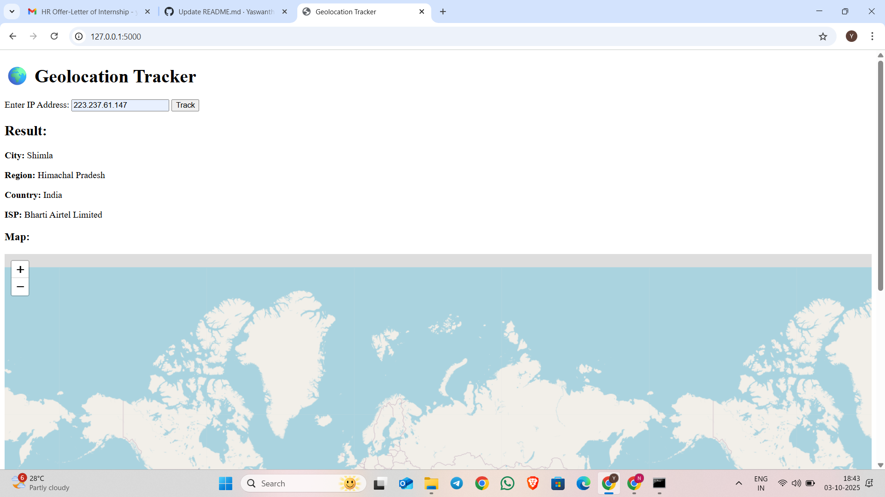

🌍 HexSoftwares Geolocation Tracker
📌 Project Overview

The Geolocation Tracker is a Python + Flask based web application that fetches the user’s geolocation using their IP address and displays it on an interactive map.

This project was developed as part of the HexSoftwares Internship Program to demonstrate skills in Python, Flask, APIs, and web development.

🚀 Features

Detects user’s location using IP address

Displays location details (City, Region, Country, Coordinates)

Shows the location on an interactive Folium map

Clean and user-friendly web interface

🛠️ Technologies Used

Python 3

Flask (for web application)

Folium (for interactive maps)

Requests (for IP geolocation API)

HTML + Jinja2 templates

⚙️ Installation & Setup

Clone the repository:

git clone https://github.com/Yaswanth1192/HexSoftwares_GeolocationTracker.git
cd HexSoftwares_GeolocationTracker

Create and activate a virtual environment:

python -m venv venv
venv\Scripts\activate   # On Windows
source venv/bin/activate # On Linux/Mac

Install dependencies:

pip install -r requirements.txt

Run the application:

python app.py

Open your browser and go to:

http://127.0.0.1:5000/

📸 Demo Screenshot

Here’s how the Geolocation Tracker looks when running locally:

👨‍💻 Author

Nadapana Yaswanth

Internship Project @ HexSoftwares

GitHub Profile
